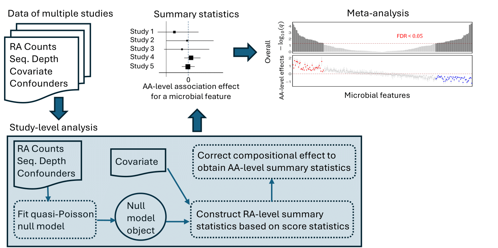

# Introduction

This R package implements `PALM` [1], a quasi-Poisson-based framework designed for robust, scalable, and reproducible identification of covariate-associated microbial features in large-scale microbiome association studies and meta-analyses. The package can perform single-study association analysis and meta-analysis across multiple studies. This tutorial provides examples demonstrating meta-analysis.

Figure. 1 shows the  schematic overview of PALM for meta-analysis. In a meta-analysis, PALM takes microbiome RA count data for $K$, the covariate of interest, and any confounders that need to be adjusted for in each study as input to perform study-level analysis. For each feature in each study, PALM generates summary association statistics, including the estimate of the covariate effect on the AA of the feature and the variance of the estimate. These summary statistics across studies are finally combined to perform association testing in meta-analysis. Covariate-associated microbial features are selected based on the test $p$-values accounting for multiple testing.

```{r, echo=FALSE, fig.cap="Schematic overview of PALM for meta-analysis.", fig.align="center"}

```

# Installation

Install package from GitHub.

```{r getPackage, echo=TRUE}
if(!require("PALM", quietly = TRUE)){
  devtools::install_github("ZjpWei/PALM_package")
}
```

Load the required packages. 

```{r load, echo=TRUE, message=FALSE, warning=FALSE}
library("PALM")
library("ggplot2")
library("cowplot")
library("tidyverse")
library("DT")
options(DT.options = list(
  initComplete = JS("function(settings, json) {",
  "$(this.api().table().header()).css({'background-color': 
  '#000', 'color': '#fff'});","}")))
```

# Meta-analysis given all samples of all participating studies

There are two approaches PALM can run meta-analysis. 

Approach #1: If the individual-level sample data across all participating studies are available, the function `palm` can take these data as input to generate, harmonize, and combine summary association statistics across studies for fast and reliable identification of microbial features. 

Approach #2: If individual-level samples of each study are not in a central place, summary statistics can be generated for each study separately using the functions `palm.null.model` and `palm.get.summary`. The summary statistics can be transported to a central place to be harmonized and combined for feature selection using the function `palm.meta.summary`.

We demonstrate Approach #1 in this session and Approach #2 in the next session.

Here we use the datasets from two metagenomics studies of colorectal cancer (CRC) [2] to demonstrate the use of each function. The `CRC_abd` is a list of sample-by-feature matrices of relative abundance counts of 267 species under order *Clostridiales* from the two studies. The `CRC_meta` is a data frame including the sample-level variables from these two studies. In particular, the following variables are in the `CRC_meta` data:

* Sample identity: "Sample_ID"

* Study name: "Study"

* Disease status: "Group"

```{r echo=TRUE}
## Load CRC data
data("CRC_data")
CRC_abd <- CRC_data$CRC_abd
CRC_meta <- CRC_data$CRC_meta
```


```{r echo=TRUE, message=TRUE, warning=FALSE}
# Prepare input data
rel.abd <- list()
covariate.interest <- list()
for(d in unique(CRC_meta$Study)){
  rel.abd[[d]] <- CRC_abd[CRC_meta$Sample_ID[CRC_meta$Study == d],]
  disease <- as.numeric(CRC_meta$Group[CRC_meta$Study == d] == "CRC")
  names(disease) <- CRC_meta$Sample_ID[CRC_meta$Study == d]
  covariate.interest[[d]] <- matrix(disease, ncol = 1, dimnames = list(names(disease), "disease"))
}

# palm analysis
meta.result <- palm(rel.abd = rel.abd, covariate.interest = covariate.interest)
```

The table below presents results for 20 microbial features, including overall association effect estimates, standard errors, p-values, and q-values for testing the overall effect; p-values and q-values for testing cross-study effect heterogeneity; and summary statistics (association effect estimates and standard errors) for individual studies.

```{r}
meta.result$disease %>% dplyr::slice(1:20) %>% 
  mutate(across(where(is.numeric), ~ round(.x, digits = 4))) %>% 
  datatable()
```

The figure below displays the features with $q$-value $≤ 0.05$. The dots in scatter plot represent the overall association effect estimates with lines indicating the 95% confidence intervals. The bar plot shows the $-\log_{10}(q\text{-value})$.

```{r, warning=FALSE, fig.align="center"}
## summarize results
palm.df <- meta.result$disease %>% dplyr::filter(qval <= 0.05) %>%
  dplyr::filter(coef > 0) %>% arrange(qval) %>%
  dplyr::add_row(meta.result$disease %>% dplyr::filter(qval <= 0.05) %>%
  dplyr::filter(coef < 0) %>% arrange(desc(qval))) %>%
  dplyr::transmute(feature = factor(feature, levels = feature), coef, stderr, qval, sig = (qval <= 0.05),
                   dir = case_when(coef > 0 & qval <= 0.05 ~ "pos",
                                   coef < 0 & qval <= 0.05 ~ "neg",
                                   TRUE ~ "other")) %>% arrange(desc(row_number()))  

## generate bar plot
df.bar <- palm.df %>% ggplot(aes(x=feature, y=-log10(qval), fill= sig)) +
      geom_bar(stat="identity") + ylim(0, 2.5) + scale_fill_manual(
        breaks = c(TRUE, FALSE), values = c("grey50", "grey80")) +
      geom_hline(aes(yintercept = -log10(0.05)),colour="#990000", linetype="dashed") +
      theme_minimal() + coord_flip() + ylab("-log10 (q-value)") +
         theme(axis.title.x = element_text(size = 10),
               axis.title.y = element_blank(),
               axis.ticks = element_blank(),
               panel.grid = element_blank(),
               plot.title = element_text(hjust = 0.5, size = 20),
               panel.background = element_rect(fill=NULL, colour='black', linewidth = 1),
               axis.text.y = element_blank(),
               axis.text.x =  element_text(size = 10),
               legend.title = element_text(hjust = 0.5, size = 16),
               legend.text = element_text(size = 10),
               legend.position = "none",
               legend.direction = "vertical",
               legend.box = "vertical",
               strip.text = element_blank())

## generate scatter plot
df.scatter <- palm.df %>% ggplot(aes(x=feature, y=coef)) +
      geom_errorbar(aes(ymin = coef - 1.96 * stderr, ymax = coef + 1.96 * stderr), color = "grey80",
                    width = 0, linewidth = 0.5) +
      geom_point(aes(color = dir), pch = 18, size = 2.5) + ylim(-3, 3) +
      geom_hline(aes(yintercept = 0),colour="#990000", linetype="dashed") +
      theme_minimal() + scale_color_manual(
        breaks = c("pos", "other", "neg"),
        values = c("red", "grey80", "blue")) +
      coord_flip() + ylab("Meta Coefficients") +
  theme(axis.title.x = element_text(size = 10),
        axis.title.y = element_text(size = 10),
        axis.ticks = element_blank(),
        panel.grid = element_blank(),
        plot.title = element_text(hjust = 0.5, size = 20),
        panel.background = element_rect(fill=NULL, colour='black', linewidth = 1),
        axis.text.y = element_text(size = 10),
        axis.text.x =  element_text(size = 10),
        legend.title = element_text(hjust = 0.5, size = 16),
        legend.text = element_text(size = 10),
        legend.position = "none",
        legend.direction = "vertical",
        legend.box = "vertical",
        strip.text = element_blank())

## plot
plot_grid(df.scatter, df.bar, nrow = 1, align = 'h',  rel_widths = c(0.73, 0.27))
```

The figure below shows dots representing study-level association effect estimates with lines indicating the 95% confidence intervals. The PALM effect estimates show good consistency across studies.

```{r, warning=FALSE, fig.align="center"}
df.plot <- NULL
df.area <- NULL
for(l in palm.df$feature){
    df.plot <- rbind(df.plot, tibble(feature = factor(l, levels = levels(palm.df$feature)), 
                                     Study = c("FR-CRC", "DE-CRC"),
                                     AA = c(meta.result$disease[meta.result$disease$feature == l, "FR-CRC_effect"],
                                            meta.result$disease[meta.result$disease$feature == l, "DE-CRC_effect"]),
                                     ci = 1.96 * c(meta.result$disease[meta.result$disease$feature == l, "FR-CRC_stderr"],
                                                   meta.result$disease[meta.result$disease$feature == l, "DE-CRC_stderr"])))
    if(meta.result$disease[meta.result$disease$feature == l, "qval.het"] <= 0.1){
      df.area <- rbind(df.area, tibble(species = l, AA = 0))
  }
}

g.PALM <- df.plot %>% ggplot(aes(x = feature, y= AA)) +
    geom_errorbar(aes(ymin = AA - ci, ymax = AA + ci, group = Study),
                  position = position_dodge(width = 0.6),
                  width = 0, linewidth = 0.5) +
    geom_point(pch = 18, aes(color = Study),
               size = 2.5, position = position_dodge(width = 0.6)) +
    theme_minimal() + ylab("PALM\nCoefficients") +
    coord_flip() +
    geom_hline(aes(yintercept = 0),colour="#990000", linetype="dashed") +
    ylim(-8, 4.5) +
    theme(axis.title.y = element_text(size = 13),
          axis.title.x = element_text(size = 13),
          axis.ticks = element_blank(),
          panel.grid = element_blank(),
          panel.background = element_rect(fill=NULL, colour='black', linewidth = 1),
          axis.text.y = element_text(size = 13),
          axis.text.x = element_text(size = 13),
          legend.title = element_text(hjust = 0.5, size = 16),
          legend.text = element_text(size = 13),
          legend.position = c(0.2, 0.85),
          legend.direction = "vertical",
          legend.box = "vertical",
          strip.text = element_blank()) +
    guides(color = guide_legend(reverse=T))

if(!is.null(df.area)){
  g.PALM <- g.PALM + geom_rect(data = df.area,
                               aes(xmin = as.numeric(species) - 0.5,
                                   xmax = as.numeric(species) + 0.5,
                                   ymin = -Inf, ymax = Inf),
                                   fill = "yellow", alpha = 0.2)
}
  
g.PALM
```

# Meta-analysis given samples of one study at a time
If the datasets of different studies live in different locations and cannot be conveniently shared among studies, we can first generate summary statistics for each study:

```{r echo=TRUE, message=FALSE, warning=FALSE}
## Generate summary statistics for each study
null.obj.FR <- palm.null.model(rel.abd = rel.abd$`FR-CRC`)
summary.stats.FR <- palm.get.summary(null.obj = null.obj.FR, covariate.interest = covariate.interest$`FR-CRC`)

null.obj.DE <- palm.null.model(rel.abd = rel.abd$`DE-CRC`)
summary.stats.DE <- palm.get.summary(null.obj = null.obj.DE, covariate.interest = covariate.interest$`DE-CRC`)
```

These summary statistics can be transported to a central location for meta-analysis:

```{r echo=TRUE, message=FALSE, warning=FALSE}
## Concatenate summary statistics
summary.stats.merge <- c(summary.stats.FR, summary.stats.DE)
names(summary.stats.merge) <- c("FR-CRC", "DE-CRC")

## Meta-analysis to harmonize and combine summary statistics across studies
meta.result.2 <- palm.meta.summary(summary.stats = summary.stats.merge)
```

The meta-analysis results generated in this way are identical to those from the previous session.

# Meta-analysis of association scan for multiple covariates of interest
Microbiome association studies can involve a large number of covariates of interest (e.g., omics variables). We show here how to  use PALM to meta-analyze eight microbiome-metabolome association studies [3]. In these eight studies, we have 101 genera and 450 metabolites and we are interested in identifying genera that are associated with individual metabolites. This analysis takes approximately 50 seconds.

```{r echo=TRUE, message=FALSE, warning=FALSE}
## Load metabolite data: 
## You may see the following website on how to directly load data from 
## github into R https://github.com/ZjpWei/Melody/raw/main/Metabolite.rda
options(timeout = 300)
load(file = url("https://github.com/ZjpWei/Melody/raw/main/Metabolite.rda"))

## Change genera names
for(d in names(otu_data_lst)){
  colnames(otu_data_lst[[d]]) <-  gsub(".*;g__", "", colnames(otu_data_lst[[d]]))
}

## Get null model
null.obj <- palm.null.model(rel.abd = otu_data_lst, covariate.adjust = covariates_adjust_lst)

## Get summary statistics
summary.stat <- palm.get.summary(null.obj = null.obj, covariate.interest = cmpd_data_lst,
                                 cluster = cluster_data_lst)

## Meta-analysis
meta.scan.result <- palm.meta.summary(summary.stats = summary.stat)
```

The following shows the effect estimates of 20 microbial features for 5 metabolites.

```{r echo=TRUE}
meta.sum <- lapply(meta.scan.result, function(d){d %>% tibble::column_to_rownames("feature")})
selected.num <- sort(unlist(lapply(meta.sum, function(d){sum(d$qval <= 0.05)})), decreasing = TRUE)
top.cov.name <- names(selected.num)[1:min(5, length(selected.num))]
coef_mat <- do.call(cbind, lapply(meta.sum[top.cov.name], function(d){d[,"coef",drop=FALSE]}))
colnames(coef_mat) <- top.cov.name
coef_mat %>% dplyr::slice(1:20) %>% 
  mutate(across(where(is.numeric), ~ round(.x, digits = 4))) %>% 
  datatable()
```

The following figure displays the features associated with butyrate production with $q$-value $\leq 0.05$. The dots in scatter plot represent the overall association effect estimates with lines indicating the 95% confidence intervals. The bar plot shows the $-\log_{10}(q\text{-value})$.

```{r, fig.width=8, fig.height=8, warning=FALSE, fig.align="center"}
palm.df <- meta.scan.result$HMDB0000039 %>% dplyr::filter(qval <= 0.05) %>%
  dplyr::filter(coef > 0) %>% arrange(qval) %>%
  dplyr::add_row(meta.scan.result$HMDB0000039 %>% dplyr::filter(qval <= 0.05) %>%
  dplyr::filter(coef < 0) %>% arrange(desc(qval))) %>%
  dplyr::transmute(feature = factor(feature, levels = feature), coef, stderr, qval, sig = (qval <= 0.05),
                   dir = case_when(coef > 0 & qval <= 0.05 ~ "pos",
                                   coef < 0 & qval <= 0.05 ~ "neg",
                                   TRUE ~ "other")) %>% arrange(desc(row_number()))  

## generate bar plot
df.bar <- palm.df %>% ggplot(aes(x=feature, y=-log10(qval), fill= sig)) +
      geom_bar(stat="identity") + ylim(0, 10) + scale_fill_manual(
        breaks = c(TRUE, FALSE), values = c("grey50", "grey80")) +
      geom_hline(aes(yintercept = -log10(0.05)),colour="#990000", linetype="dashed") +
      theme_minimal() + coord_flip() + ylab("-log10 (q-value)") +
         theme(axis.title.x = element_text(size = 13),
               axis.title.y = element_blank(),
               axis.ticks = element_blank(),
               panel.grid = element_blank(),
               plot.title = element_text(hjust = 0.5, size = 20),
               panel.background = element_rect(fill=NULL, colour='black', linewidth = 1),
               axis.text.y = element_blank(),
               axis.text.x =  element_text(size = 13),
               legend.title = element_text(hjust = 0.5, size = 16),
               legend.text = element_text(size = 13),
               legend.position = "none",
               legend.direction = "vertical",
               legend.box = "vertical",
               strip.text = element_blank())

## generate scatter plot
df.scatter <- palm.df %>% ggplot(aes(x=feature, y=coef)) +
      geom_errorbar(aes(ymin = coef - 1.96 * stderr, ymax = coef + 1.96 * stderr), color = "grey80",
                    width = 0, linewidth = 0.5) +
      geom_point(aes(color = dir), pch = 18, size = 2.5) + ylim(-0.6, 0.6) +
      geom_hline(aes(yintercept = 0),colour="#990000", linetype="dashed") +
      theme_minimal() + scale_color_manual(
        breaks = c("pos", "other", "neg"),
        values = c("red", "grey80", "blue")) +
      coord_flip() + ylab("Meta Coefficients") +
  theme(axis.title.x = element_text(size = 13),
        axis.title.y = element_text(size = 13),
        axis.ticks = element_blank(),
        panel.grid = element_blank(),
        plot.title = element_text(hjust = 0.5, size = 20),
        panel.background = element_rect(fill=NULL, colour='black', linewidth = 1),
        axis.text.y = element_text(size = 13),
        axis.text.x =  element_text(size = 13),
        legend.title = element_text(hjust = 0.5, size = 16),
        legend.text = element_text(size = 13),
        legend.position = "none",
        legend.direction = "vertical",
        legend.box = "vertical",
        strip.text = element_blank())


## plot
plot_grid(df.scatter, df.bar, nrow = 1, align = 'h',  rel_widths = c(0.62, 0.38))
```

The following figure displays the features associated with butyrate production with $q$-value $\leq 0.05$. The dots in the scatter plot represent the study-level association effect estimates, and the lines indicate 95% confidence intervals. The PALM effect estimates show good consistency across studies.

```{r, fig.width=6, fig.height=12, warning=FALSE, fig.align="center"}
## summarize HMDB0000039 analysis
PALM.df <- meta.scan.result$HMDB0000039 %>% dplyr::filter(qval <= 0.05) %>%
  dplyr::filter(coef > 0) %>% arrange(qval) %>%
  dplyr::add_row(meta.scan.result$HMDB0000039 %>% dplyr::filter(qval <= 0.05) %>%
  dplyr::filter(coef < 0) %>% arrange(desc(qval))) %>% tibble::column_to_rownames("feature")

## PALM plots
df.plot <- NULL
for(l in names(otu_data_lst)){
  if(paste0(l,"_effect") %in% colnames(PALM.df)){
    df.plot <- rbind(df.plot, tibble(genus = factor(rownames(PALM.df), levels = rownames(PALM.df)),
                                     Study = factor(rep(l, nrow(PALM.df)), levels = names(otu_data_lst),
                                                    labels = paste0("MTBL", 1:8)),
                                     AA = PALM.df[,paste0(l,"_effect")],
                                     AA.lower = PALM.df[, paste0(l,"_effect")] - PALM.df[, paste0(l,"_stderr")],
                                     AA.upper = PALM.df[, paste0(l,"_effect")] + PALM.df[, paste0(l,"_stderr")]))
  }
}
df.area <- tibble(genus = factor(rownames(PALM.df %>% dplyr::filter(qval.het <= 0.1)), levels= rownames(PALM.df)), AA = 0)

g.PALM <- df.plot %>%
  ggplot(aes(x=genus, y=AA)) +
  geom_errorbar(aes(ymin = AA.lower, ymax = AA.upper, group = Study),
                position = position_dodge(width = 0.6),
                width = 0, linewidth = 0.5) +
  geom_point(pch = 18, aes(color = Study),
             size = 2.5, position = position_dodge(width = 0.6)) +
  ylab("PALM\nCoefficients") + xlab("features") +
  geom_hline(aes(yintercept = 0),colour="#990000", linetype="dashed") +
  scale_color_manual(values = c("#F8766D","#CD9600","#7CAE00","#00BE67",
                                "#00BFC4","#00A9FF","#C77CFF","#FF61CC"),
                     breaks = c("MTBL8", "MTBL7", "MTBL6", "MTBL5",
                                "MTBL4", "MTBL3", "MTBL2", "MTBL1")) +
  coord_flip() + theme_minimal() +  ylim(-2.5, 1.5) +
  theme(axis.title.x = element_text(size = 15),
        axis.title.y = element_text(size = 15),
        axis.ticks = element_blank(),
        panel.grid = element_blank(),
        panel.background = element_rect(fill=NULL, colour='black', linewidth = 1),
        axis.text.y = element_text(size = 15),
        axis.text.x = element_text(size = 15),
        legend.title = element_text(hjust = 0.5, size = 16),
        legend.text = element_text(size = 13),
        legend.position = c(0.15, 0.91),
        legend.direction = "vertical",
        legend.box = "vertical",
        strip.text = element_blank()) +
  guides(color = guide_legend(reverse=T))

if(nrow(df.area) != 0){
  g.PALM <- g.PALM + geom_rect(data = df.area, aes(xmin = as.numeric(genus) - 0.5,
                                                   xmax = as.numeric(genus) + 0.5,
                                                   ymin = -Inf, ymax = Inf),
                               fill = "yellow", alpha = 0.2)
}

g.PALM
```

# Session information

```{r}
sessionInfo()
```

# Reference
1. Wei et al. Fast and reliable association discovery in large-scale microbiome studies and meta-analyses using PALM. Submitted.

2. Wirbel, Jakob et al. Meta-analysis of fecal metagenomes reveals global microbial features that are specific for colorectal cancer. 

3. Muller, E., Algavi, Y.M. & Borenstein, E. The gut microbiome-metabolome dataset collection: a curated resource for integrative meta-analysis. npj Biofilms Microbiomes 8, 79 (2022).
